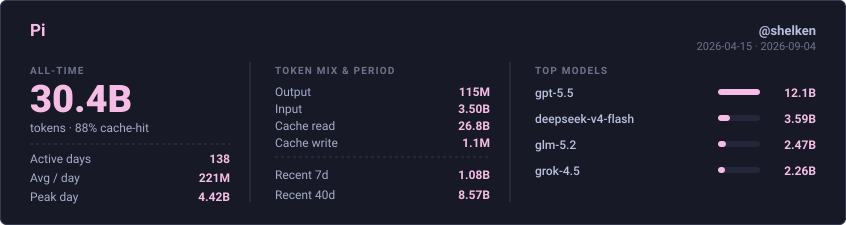
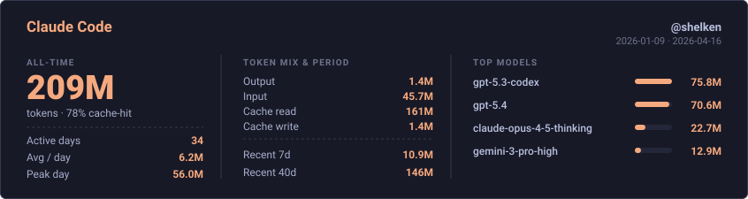
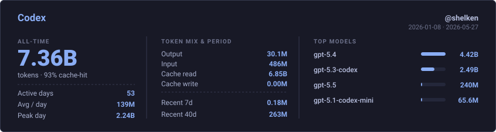
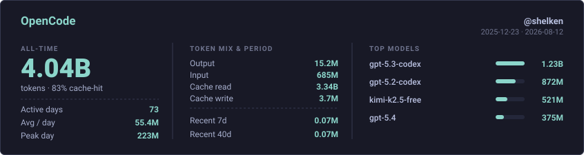

  <samp>
    <a href="https://blog.ooooo.space/">blog</a> ·
    <a href="https://x.com/shelken">x</a> ·
    <a href="https://memos.ooooo.space/">memos</a>
  </samp>

---

## 最近Vibe统计

<!-- PI-USAGE:START -->

**最近Vibe统计 · Pi**

**历史 · Claude Code**

**历史 · Codex**

**历史 · OpenCode**

<!-- PI-USAGE:END -->

---

### Currently working on

- [home-ops](https://github.com/shelken/home-ops) — K3s GitOps cluster (Flux, Cilium, Longhorn, VolSync, CNPG, SOPS)
- [nix-config](https://github.com/shelken/nix-config) — nix-darwin / NixOS / Home Manager flakes for daily machines ★5
- [pi-extensions](https://github.com/shelken/pi-extensions) — monorepo of Pi agent packages (copy-cut, pi-guard, model prompts, …)
- [containers](https://github.com/shelken/containers) — multi-arch images for homelab services

### Featured

- [Url-Scheme](https://github.com/shelken/Url-Scheme) — iOS Shortcuts URL schemes ★19
- [awesome-stars](https://github.com/shelken/awesome-stars) — starred repos index ★7

### Recent blog posts

<!-- BLOG-POST-LIST:START -->
- [在 iOS 上同时使用代理和内网](https://blog.ooooo.space/p/%E5%9C%A8-ios-%E4%B8%8A%E5%90%8C%E6%97%B6%E4%BD%BF%E7%94%A8%E4%BB%A3%E7%90%86%E5%92%8C%E5%86%85%E7%BD%91/) — 2026-06-25
- [gh/glab 命令快速上手](https://blog.ooooo.space/p/gh_glab/) — 2024-01-19
- [简单地使用开源的输入法 rime](https://blog.ooooo.space/p/%E7%AE%80%E5%8D%95%E5%9C%B0%E4%BD%BF%E7%94%A8%E5%BC%80%E6%BA%90%E7%9A%84%E8%BE%93%E5%85%A5%E6%B3%95-rime/) — 2023-11-19
- [在不用 Tailscale 的情况下使用 Tailscale](https://blog.ooooo.space/p/%E5%9C%A8%E4%B8%8D%E7%94%A8tailscale%E7%9A%84%E6%83%85%E5%86%B5%E4%B8%8B%E4%BD%BF%E7%94%A8tailscale/) — 2023-04-05
- [Asciinema 的初次使用](https://blog.ooooo.space/p/asciinema%E7%9A%84%E5%88%9D%E6%AC%A1%E4%BD%BF%E7%94%A8/) — 2023-03-05
- [Linux 上使用 clash](https://blog.ooooo.space/p/linux%E4%B8%8A%E4%BD%BF%E7%94%A8clash/) — 2022-12-21
<!-- BLOG-POST-LIST:END -->

[更多文章 →](https://blog.ooooo.space/)

---

### Tech stack

**Languages**

**Java / backend**

**Cloud native / GitOps**

**IaC / secrets**

**Network / security**

**Observability**

**Automation / vision**

**macOS / Agent**

More on [blog.ooooo.space](https://blog.ooooo.space/) · [repositories](https://github.com/shelken?tab=repositories)
